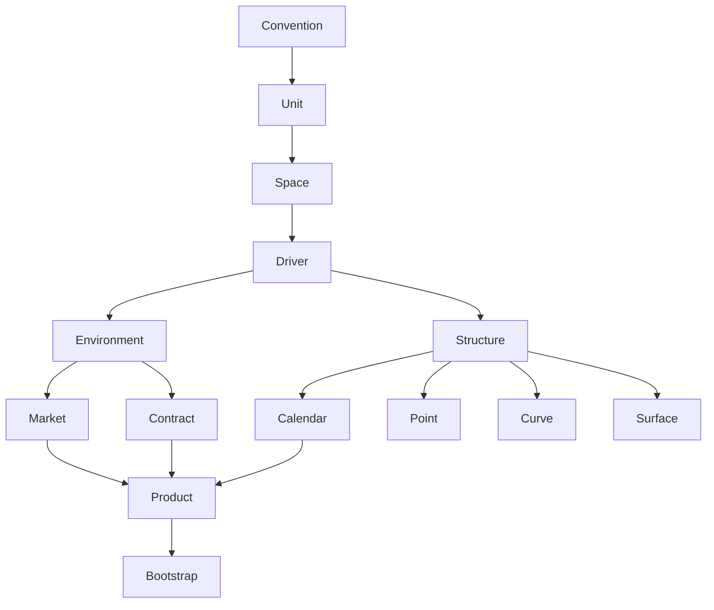
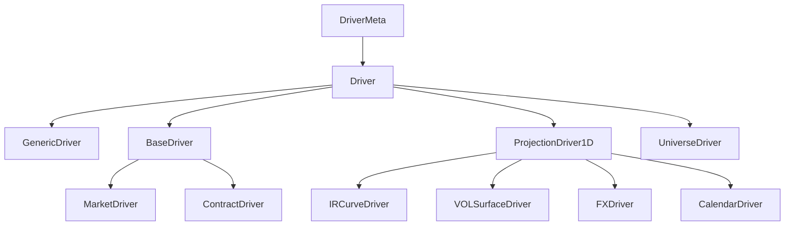

# finStruct

The finStruct library provides an environment for (quantitative) finance typical structures.

On the one hand, functional structures (where a combination of variables is mapped to one or more values) such as Interest Rate Curves and Volatility Surfaces are implemented. These are implemented in a general way, such that the user also has the freedom to construct any functional surface possible, without being restricted to certain dimensions or variables. It is implemented in a way similar to the implementation of sparse matrices. 
A diversity on operations is also implementede for the most frequently occuring structures, with a clear focus on Interest Rate Curves. Interpolation, Bootstrapping from market instruments, combining of curves and calculating different types of rates and converting curves is implemented.

On the other hand, more specific convention-related objects are implemented as well. A major example of this is the Calendar, which can be used in the construction of Fixed Income instruments but is used in the bootstrapping of curves as well.

This library does not have as goal to be a one-stop-shop for all financial analysis, but rather serves as a research environment in which to more easily conduct all the data manipulation and benchmarking required.

## Timeline

- [ ] Curves
  -  [ ] Basic Gridinterpolator
- [ ] Implement framework for interpolation

## Questions

A main one is how to decide on "static" features for structures.
A possibility could also be to make it inherit from userdict, by using the dates as keys for example.

## Design

### General

### Driver

A driver is what underlying should "drive" a structure.
It should be defined by a set of spaces.
The DerivedDriver class should indicate what the dimensions are, and which units should be in each dimension (space).
The DerivedDriver object should instantiate these with conventions.

The Driver class is there to interface with the metaclass.
How it is now, the _SPACES can simply be replaced by a dict.

At the start, the Driver might have very limited capabilities and will be there mostly to combine the Spaces in a useful way.
The main challenge will be in designing the Metaclass to work in the general way we want it to.

IDEA: A function that, given another driver, converts the driver to the same basis.